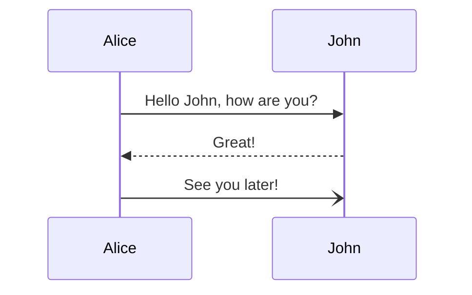
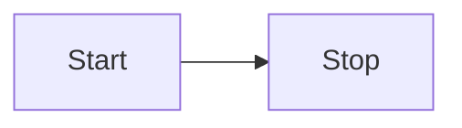

## GitHub Flavored Markdown (GFM)

- [ ] GitHub Flavored Markdown (GFM)
- [ ] セクションリンク
- [ ] 相対リンク
- [ ] Markdown 絵文字
- [ ] 脚注
- [ ] アラート
- [ ] 画像のテーマ指定
- [ ] カラーチップの表示
- [ ] シンタックスハイライト
- [ ] 数式
- [ ] ダイアグラム
- [ ] メンション
- [ ] Ticket の参照
- [ ] コミットハッシュの参照
- [ ] Ticket ラベル
- [ ] Suggested changes
- [ ] コードスニペットの表示
- [ ] 外部リソースの参照
- [ ] Front matter のテーブル表示

## セクションリンク

[セクションリンク](#セクションリンク)

## 相対リンク

[README](README.md)

## Markdown 絵文字

:tada:

## 脚注

This is footnote.[^footnote]

[^footnote]: Footnotes is this.

## アラート

> [!note]
> This is note!

## 画像のテーマ指定

|light|dark|
|:--:|:--:|
|![GitHub-Mark-Light][light]|![GitHub-Mark-Dark][dark]|

[dark]: https://user-images.githubusercontent.com/3369400/139447912-e0f43f33-6d9f-45f8-be46-2df5bbc91289.png
[light]: https://user-images.githubusercontent.com/3369400/139448065-39a229ba-4b06-434b-bc67-616e2ed80c8f.png

![GitHub-Mark-Light][lightonly]
![GitHub-Mark-Dark][darkonly]

[darkonly]: https://user-images.githubusercontent.com/3369400/139447912-e0f43f33-6d9f-45f8-be46-2df5bbc91289.png#gh-dark-mode-only
[lightonly]: https://user-images.githubusercontent.com/3369400/139448065-39a229ba-4b06-434b-bc67-616e2ed80c8f.png#gh-light-mode-only

----------

<picture>
    <source media="(prefers-color-scheme: dark)" srcset="https://3.bp.blogspot.com/-J2x8p6trBBo/Ws2u9DhNxjI/AAAAAAABLSk/D_59917TxD4CPPbLkRTX4OOSAHDoWOOSgCLcBGAs/s800/internet_darkweb.png">
    
</picture>

## カラーチップの表示

`#FFFFFF`

## シンタックスハイライト

```python
print("Hello World!")
```

## 数式

$f$, $`g`$

$$g(x) = \alpha x^2 + \beta x + \gamma$$

```math
g(\xi) = \alpha \xi^2 + \beta \xi + \gamma
```

## ダイアグラム





```geojson
{
  "type": "Feature",
  "geometry": {
    "type": "Point",
    "coordinates": [125.6, 10.1]
  },
  "properties": {
    "name": "Dinagat Islands"
  }
}
```

```stl
solid cube_corner
  facet normal 0.0 -1.0 0.0
    outer loop
      vertex 0.0 0.0 0.0
      vertex 1.0 0.0 0.0
      vertex 0.0 0.0 1.0
    endloop
  endfacet
  ...
```

## メンション

@ghost

## Ticket の参照

#1

## コミットハッシュの参照

23bc7348d98e819e01815da3820844f3e0702b6a

https://github.com/jlord/sheetsee.js/commit/a5c3785ed8d6a35868bc169f07e40e889087fd2e

## Ticket ラベル

https://github.com/Yarakashi-Kikohshi/LaTeX-for-math/labels/documentation

## ~~Suggested changes~~


## コードスニペットの表示

https://github.com/Yarakashi-Kikohshi/LaTeX-for-math/blob/306251b5b3e7f68f4bfeac65ee498916bd131843/.gitignore#L2-L13

## 外部リソースの参照


## Front matter のテーブル表示


|                                Syntax | Release | Milestone | files | Tickets |  Comments   | Wiki | Gist |
| ------------------------------------: | :-----: | :-------: | :---: | :-----: | :---------: | :--: | :--: |
|              GitHub Flavored Markdown |   ✓    |    ✓     |  ✓   |   ✓    |     ✓      |  ✓  |  ✓  |
|                        Markdown emoji |   ✓    |    ✓     |  ✓   |   ✓    |     ✓      |  ✓  |  ✓  |
|                             Footnotes |   ✓    |    ✓     |  ✓   |   ✓    |     ✓      |      |  ✓  |
|                                Alerts |   ✓    |    ✓     |  ✓   |   ✓    |     ✓      |      |  ✓  |
| Specify images by light or dark theme |         |           |  ✓   |   ✓    |     ✓      |      |  ✓  |
|                         Section links |         |           |  ✓   |         |             |  ✓  |  ✓  |
|                        Relative links |         |           |  ✓   |         |             |      |      |
|                          Color models |         |    ✓     |       |   ✓    |     ✓      |      |      |
|                   Syntax highlighting |   ✓    |    ✓     |  ✓   |   ✓    |     ✓      |  ✓  |  ✓  |
|              Mathematical expressions |         |    ✓     |  ✓   |   ✓    |     ✓      |  ✓  |  ✓  |
|                              Diagrams |         |    ✓     |  ✓   |   ✓    |     ✓      |  ✓  |  ✓  |
|                               Mention |   ✓    |    ✓     |       |   ✓    |     ✓      |      |      |
|                      Ticket reference |   ✓    |    ✓     |  ✓   |   ✓    |     ✓      |  ✓  |  ✓  |
|                 Commit hash reference |   ✓    |    ✓     |       |   ✓    |     ✓      |      |      |
|                         Ticket labels |   ✓    |    ✓     |  ✓   |   ✓    |     ✓      |      |      |
|                     Suggested changes |         |           |       |         | Only in PRs |      |      |
|                          Code snippet |         |    ✓     |       |   ✓    |     ✓      |      |      |
|           External resource reference |         |    ✓     |       |   ✓    |     ✓      |      |      |
|            Front matter table display |         |           |  ✓   |         |             |      |  ✓  |
