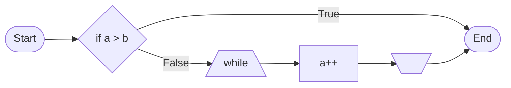

> **note**  
> this is note!

> **note**\ 
> this is note!

> **note**<br>
> this is note!

> [!NOTE]  
> Highlights information that users should take into account, even when skimming.

> [!IMPORTANT]  
> Crucial information necessary for users to succeed.

> [!WARNING]  
> Critical content demanding immediate user attention due to potential risks.


> **Note**  
> This is note!


line
break

<picture>
  <source media="(prefers-color-scheme: dark)" srcset="https://user-images.githubusercontent.com/25423296/163456776-7f95b81a-f1ed-45f7-b7ab-8fa810d529fa.png">
  
</picture>

## Is here Sectioning?

:smile:

Paragraph [^footnote]

[^footnote]: Here is footnote.

`#FFFFFF`, `#000000`

```python
print("Hello World.")
```

$f(x)$

$$ f(x) = ax^2 + bx + c $$

```math
f(x) = ax^2 + bx + c
```



@GitHub

#26, GH-26

https://github.com/jlord/sheetsee.js/issues/26 , jlord/sheetsee.js/issues/26, jlord/sheetsee.js#26

https://github.com/jlord/sheetsee.js/commit/a5c3785ed8d6a35868bc169f07e40e889087fd2e

a5c3785ed8d6a35868bc169f07e40e889087fd2e

jlord@a5c3785ed8d6a35868bc169f07e40e889087fd2e

jlord/sheetsee.js@a5c3785ed8d6a35868bc169f07e40e889087fd2e

https://github.com/Yarakashi-Kikohshi/LaTeX-for-math/labels/bug
